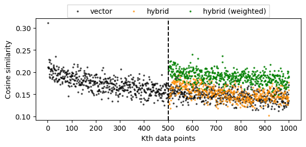

# Beyond Vector Search
Hybrid Vector/Knowledge Graph Query Engine for Enhanced Data Retrieval

## Code and Documentation
Place your entire source code in a single ZIP file (no binaries please). Your top directory should include two files: INSTALL.txt and README.txt, as described next.

- Your INSTALL.txt file should provide the detailed steps required to compile your source code. For instance, “go and download and install SomeThirdParty library” is not an acceptable instruction. Instead, provide the exact commands and URLs needed to install other libraries that are needed to compile and use your source code.

- Your README.txt should contain two sections. In the first section, you should explain the Usage of your tool, e.g. command line arguments and pointers to some small text data that can be used to run your tool. In the second section, please explain the major functions of your source code and where to find their implementations in your source code.

### Creating filtered data
- `notebooks/parsing_json.ipynb`: filter data with more overlaps, and save as pickle file
